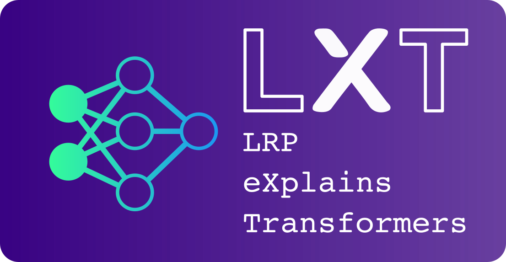
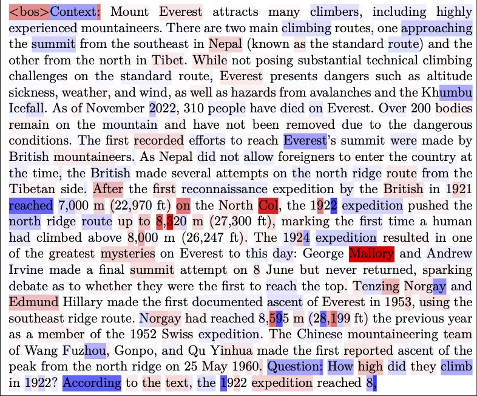
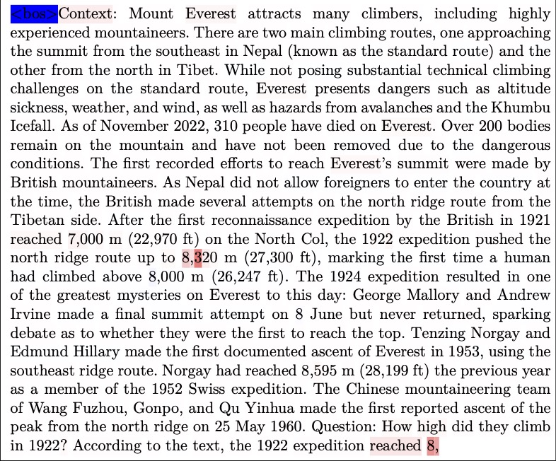
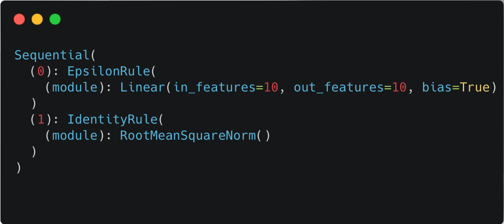

<div align="center">
  

  <h3>Layer-wise Relevance Propagation for Transformers</h3>
  <p><i>Fast, faithful explanations for transformer models with a single backward pass</i></p>
  <p><i></i></p>

  [](https://pytorch.org)
  [](https://lxt.readthedocs.io)
  [](https://opensource.org/licenses/BSD-3-Clause)
  [](https://pypi.org/project/lxt/)
</div>


## Table of Contents
- [What is LXT?](#-what-is-lxt)
- [Getting Started](#getting-started)
- [Supported Models](#-supported-models)
- [How LXT Works](#how-lxt-works)
- [Documentation](#documentation)
- [Citation](#citation)

## Accelerating eXplainable AI research for LLMs & ViTs

#### ✨ What is LXT?

LXT makes black-box transformer models explainable by precisely revealing how much each input token and individual neuron contribute to the final prediction logit. Unlike standard gradient-based methods, which can be noisy or unreliable, LXT delivers faithful attributions using AttnLRP, a backpropagation-based technique that corrects gradient flow through non-linearities. Best of all, it requires only a single backward pass.

See the dramatic improvement in explanation quality on Gemma 3 (4B):

<div align="center">
  <table>
    <tr>
      <th>Input×Gradient (Traditional)</th>
      <th>AttnLRP (Our Method)</th>
    </tr>
    <tr>
      <td>
        
        <br>
        <em>Noisy, scattered attributions</em>
      </td>
      <td>
        
        <br>
        <em>Clean, semantically coherent attributions</em>
      </td>
    </tr>
  </table>
</div>

#### 🔥 Highly efficient & Faithful Attributions

Attention-aware LRP (AttnLRP) **outperforms** gradient-, decomposition- and perturbation-based methods, provides faithful attributions for the **entirety** of a black-box transformer model while scaling in computational complexity $O(1)$ and memory requirements $O(\sqrt{N})$ with respect to the number of layers.

#### 🔎 Latent Feature Attribution & Visualization
Since we get relevance values for each single neuron in the model as a by-product, we know exactly how important each neuron is for the prediction of the model. Combined with Activation Maximization, we can label neurons or SAE features in LLMs and even steer the generation process of the LLM by activating specialized knowledge neurons in latent space!

#### 📚 Paper
For the mathematical details and foundational work, please take a look at our paper:  
[Achtibat, et al. “AttnLRP: Attention-Aware Layer-Wise Relevance Propagation for Transformers.” ICML 2024.](https://proceedings.mlr.press/v235/achtibat24a.html)  

#### 🏆 Hall of Fame
A small collection of papers that have utilized LXT:

- [Arras, et al. “Close Look at Decomposition-based XAI-Methods for Transformer Language Models.” arXiv preprint, 2025.](https://arxiv.org/abs/2502.15886)
- [Pan, et al. “The Hidden Dimensions of LLM Alignment: A Multi-Dimensional Safety Analysis.” arXiv preprint, 2025.](https://arxiv.org/abs/2502.09674)
- [Hu, et al. “LRP4RAG: Detecting Hallucinations in Retrieval-Augmented Generation via Layer-wise Relevance Propagation“ arXiv preprint, 2024.](https://arxiv.org/abs/2408.15533)
- [Sarti, et al. “Quantifying the Plausibility of Context Reliance in Neural Machine Translation.” ICLR 2024.](https://arxiv.org/abs/2310.01188)
[](https://huggingface.co/spaces/gsarti/mirage)


#### 📄 License
This project is licensed under the BSD-3 Clause License, which means that LRP is a patented technology that can only be used free of charge for personal and scientific purposes.

## Getting Started 
### 🛠️ Installation 

```bash
pip install lxt
```

Tested with: `transformers==4.52.4`, `torch==2.6.0`, `python==3.11`

### 🚀 Quickstart with 🤗 LLaMA & many more
You find example scripts in the `examples/*` directory. For an in-depth tutorial, take a look at the [Quickstart in the Documentation](https://lxt.readthedocs.io/en/latest/quickstart.html).

To get an overview, you can keep reading below ⬇️

### 🧩 Supported Models

| Model Family | Status |
|--------------|--------|
| 🦙 LLaMA 2/3 | ✅ |
| ✨ Gemma 3 | ✅ |
| 🤖 Qwen 2 | ✅ |
| 🧠 Qwen 3 | 🧪 Attribution skewed toward first token |
| 🔤 BERT | ✅ |
| 🤖 GPT-2 | ✅ Best paired with contrastive explanations |
| 🎨 Vision Transformers | ✅ |


## How LXT Works

Layer-wise Relevance Propagation is a rule-based backpropagation algorithm. This means, that we can implement LRP in a single backward pass!
For this, LXT offers two different approaches:

### 1. Efficient Implementation
Uses a Input*Gradient formulation, which simplifies LRP to a standard & fast gradient computation via monkey patching the model class.


```python
from lxt.efficient import monkey_patch

# Patch module first
monkey_patch(your_module)

# Forward pass with gradient tracking
outputs = model(inputs_embeds=input_embeds.requires_grad_())

# Backward pass
outputs.logits[...].backward()

# Get relevance at *ANY LAYER* in your model. Simply multiply the activation * gradient!
# here for the input embeddings:
relevance = (input_embeds * input_embeds.grad).sum(-1)
```
This is the **recommended approach** for most users as it's significantly faster and easier to use. This implementation technique is introduced in [Arras, et al. “Close Look at Decomposition-based XAI-Methods for Transformer Language Models.” arXiv preprint, 2025.](https://arxiv.org/abs/2502.15886)
 
### 2. Mathematical Explicit Implementation
This was used in the original [ICML 2024 paper](https://proceedings.mlr.press/v235/achtibat24a.html). It's more complex and slower, but useful for understanding the mathematical foundations of LRP.


To achieve this, we have implemented [custom PyTorch autograd Functions](https://pytorch.org/tutorials/beginner/examples_autograd/two_layer_net_custom_function.html) for commonly used operations in transformers. These functions behave identically in the forward pass, but substitute the gradient with LRP attributions in the backward pass. To compute the $\varepsilon$-LRP rule for a linear function $y = W x + b$, you can simply write
```python
import lxt.explicit.functional as lf

y = lf.linear_epsilon(x.requires_grad_(), W, b)
y.backward(y)

relevance = x.grad
```

There are also "super-functions" that wrap an arbitrary nn.Module and compute LRP rules via automatic vector-Jacobian products! These rules are simple to attach to models:

```python
from lxt.explicit.core import Composite
import lxt.explicit.rules as rules

model = nn.Sequential(
  nn.Linear(10, 10),
  RootMeanSquareNorm(),
)

Composite({
  nn.Linear: rules.EpsilonRule,
  RootMeanSquareNorm: rules.IdentityRule,
}).register(model)

print(model)
```
<div align="left">
  
</div>


## Documentation
[Click here](https://lxt.readthedocs.io) to read the documentation.

## Contribution
Feel free to explore the code and experiment with different datasets and models. We encourage contributions and feedback from the community. We are especially grateful for providing support for new model architectures! 🙏


## Citation
```
@InProceedings{pmlr-v235-achtibat24a,
  title = {{A}ttn{LRP}: Attention-Aware Layer-Wise Relevance Propagation for Transformers},
  author = {Achtibat, Reduan and Hatefi, Sayed Mohammad Vakilzadeh and Dreyer, Maximilian and Jain, Aakriti and Wiegand, Thomas and Lapuschkin, Sebastian and Samek, Wojciech},
  booktitle = {Proceedings of the 41st International Conference on Machine Learning},
  pages = {135--168},
  year = {2024},
  editor = {Salakhutdinov, Ruslan and Kolter, Zico and Heller, Katherine and Weller, Adrian and Oliver, Nuria and Scarlett, Jonathan and Berkenkamp, Felix},
  volume = {235},
  series = {Proceedings of Machine Learning Research},
  month = {21--27 Jul},
  publisher = {PMLR}
}
```

## Acknowledgements
The code is heavily inspired by [Zennit](https://github.com/chr5tphr/zennit), a tool for LRP attributions in PyTorch using hooks. Zennit is 100% compatible with the **explicit** version of LXT and offers even more LRP rules 🎉
